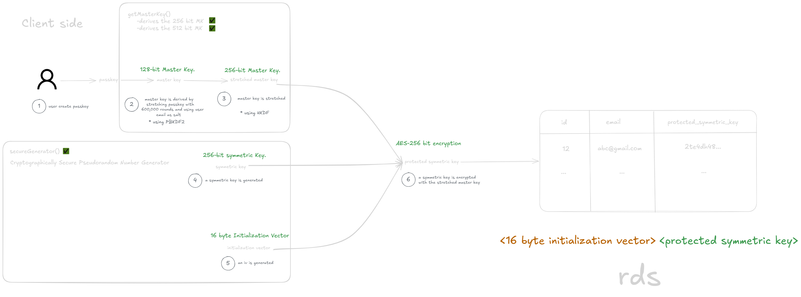
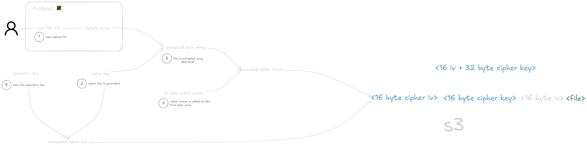

# Tatsu - The Ultimate Todo App

This is a Next.js project bootstrapped with create-next-app. A live preview of this is available on [tatsu-gg.vercel.app](https://tatsu-gg.vercel.app/)

## Introduction

Tatsu is a todo app on steroids, designed to keep you motivated and productive. Key features include:

**Evolving Avatars**: Your avatar grows as you complete your todo goals (TBD).

**Long-term Todo Tracking** : Stay on top of your big-picture tasks (TBD).

**Notion-like Editor**: A powerful, intuitive interface for note-taking.

**End-to-End Encrypted File Uploads** : Securely store and manage your files.

More exciting features coming soon! ✨

## End to End encryption

All files are end to end encrypted and stored in a aws s3 bucket. the module desgnated for retrieval, and encryption/decryption of files is called "Vault" in the app. you can read more about how I implemented it [here](https://excalidraw.com/#room=8feca98c331feac8d27b,XeidBTw8Bp2qXTVBjf41Yg)


## Running with Docker (Recommended)

The project includes a **Dockerfile** and **docker-compose.yml** for containerized development.

Make sure **Docker** and **Docker Compose** are installed.

Copy **.env.example** to **.env** and fill in the required values (AWS credentials, database URL, etc.).

**Note**: Ensure DATABASE_URL in your .env matches the values in docker-compose.yml. If you haven’t changed anything there, simply use the one provided in .env.example.

Build and start the containers:

```bash
docker compose up --build
```

This will:

Start a Postgres database (postgres:15) with persistent storage.

Start the Next.js app inside a Node.js container.

Run Prisma migrations automatically on startup.

Once running, the app will be available at http://localhost:3000.

To stop the containers:

```bash
docker compose down
```

## or

```bash
npm i
```

and then

```bash
npm run dev
```

Then, open http://localhost:3000 in your browser.

🔤 Fonts

This project uses next/font for optimized font loading. It features Poppins, a modern and elegant font from Google.
